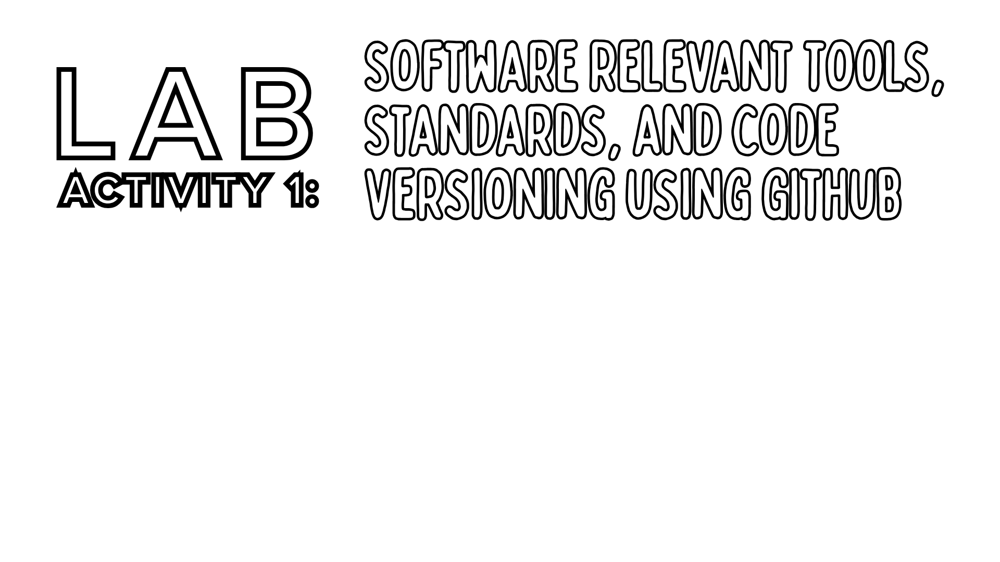

> **Note:** Parts of this documentation were assisted by AI to help ensure correctness.

**Author:** Jethro C. Naungayan

**Course & Block:** CPE106L-4_B1

## Overview

This repository reports the completion of Lab Activity 2. The activity focused on storing and processing structured data using fundamental Python data types, specifically strings, lists, tuples, and dictionaries. To demonstrate the requirements, a menu-driven command line application was developed to create, read, update, and display student data in memory.

This README specifically explains how to run the activity.

## Prerequisites & Technologies

This activity was done on Windows. To run this project, you will need the following tools and services:

* **Operating System:** Windows Subsystem for Linux (WSL) running Ubuntu
* **Language:** Python 3
* **Environment Management:** `venv` (Python Virtual Environment)
* **Version Control:** Git & GitHub

## Project Structure

Here is how the files are organized within this repository:


## How to Run the Activity (for Windows Users)

Open Windows PowerShell and run the following commands:

### 1. Enter Linux Environment
```powershell
wsl   # Switches your terminal to your Ubuntu terminal
cd ~  # Brings you to the Linux main user folder
```

### 2. Clone the Repository
```bash
git clone https://github.com/20pesos/Naungayan_Jethro_labactivity2  # Downloads a copy of the repository
cd Naungayan_Jethro_labactivity2                                    # Enters the folder of the copy
```

### 3. Create and Activate a Virtual Environment
Because virtual environments are not tracked by Git, you must create a new one locally and activate it.
```bash
python3 -m venv .venv
source .venv/bin/activate
```
*(You will know it is active when your terminal line starts with `(.venv)`).*

### 4. Run the Main Program
```bash
python3 source/main.py
```

#### 4.1. Program Features
Once running, the system presents a numbered menu to perform CRUD operations (Create, Read, Update, Display).


The data is stored temporarily in an in-memory dictionary while the program is active, utilizing nested dictionaries, lists for subjects, and tuples for fixed institutional data.

#### 4.2. Fail-Proof Validation Features
To prevent crashes and bad data, the program is strictly locked down with the following rules:
*   **Empty Input Traps:** Infinite loops prevent users from leaving required fields blank.
*   **Strict ID Formatting:** Rejects any Student ID that is not exactly 4 numerical digits.
*   **Name Character Checking:** Rejects names containing numbers or unsupported symbols.
*   **Duplicate Prevention:** Scans the database to block identical Student IDs and duplicate email addresses.
*   **Safe Updates:** When modifying a record, pressing 'Enter' safely retains the old data without overwriting it.

### 6. Deactivate the Environment
When you are done testing the application, exit the virtual environment by typing:
```bash
deactivate
```
