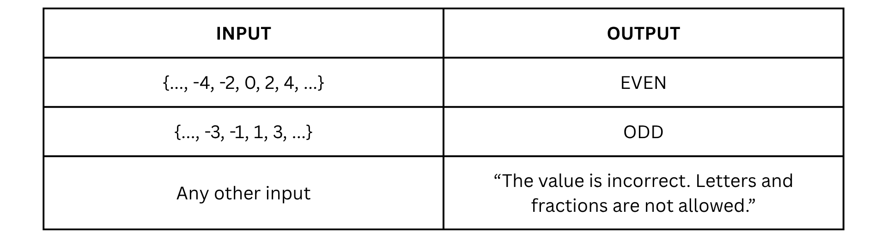
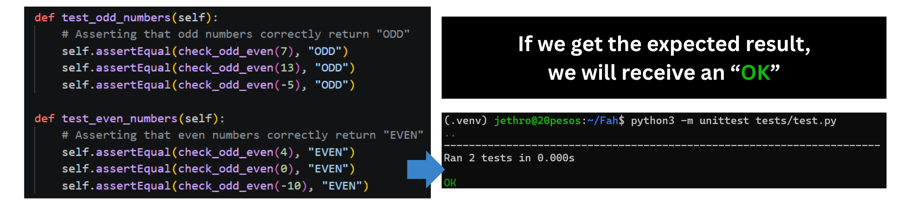

> **Note:** Parts of this documentation were assisted by AI to help ensure correctness.

**Author:** Jethro C. Naungayan

**Professor:** Dr. John De Guzman Tarampi

**Course & Block:** CPE106L-4_B1

## Overview

This repository reports the completion of Lab Activity 3. The activity focused on translating functional requirements into a class-based design. To demonstrate these concepts, the University Enrollment System from the previous lab was refactored into an Object-Oriented architecture using two related classes (`Student` and `EnrollmentSystem`) to create, read, update, and display student records.

This README specifically explains how to run the activity.

## Prerequisites & Technologies

This activity was done on Windows. To run this project, you will need the following tools and services:

* **Operating System:** Windows Subsystem for Linux (WSL) running Ubuntu
* **Language:** Python 3
* **Environment Management:** `venv` (Python Virtual Environment)
* **Version Control:** Git & GitHub

## Project Structure

Here is how the files are organized within this repository:


## How to Run the Activity (for Windows Users)

Open Windows PowerShell and run the following commands:

### 1. Enter Linux Environment
```powershell
wsl   # Switches your terminal to your Ubuntu terminal
cd ~  # Brings you to the Linux main user folder
```

### 2. Clone the Repository
```bash
git clone https://github.com/20pesos/Naungayan_Jethro_labactivity3  # Downloads a copy of the repository
cd Naungayan_Jethro_labactivity3                                    # Enters the folder of the copy
```

### 3. Create and Activate a Virtual Environment
Because virtual environments are not tracked by Git, you must create a new one locally and activate it.
```bash
python3 -m venv .venv
source .venv/bin/activate
```
*(You will know it is active when your terminal line starts with `(.venv)`).*

### 4. Run the Main Program
```bash
python3 source/main.py
```

#### 4.1. Program Features
Once running, the system presents a numbered menu to perform CRUD operations (Create, Read, Update, Display). Type in a number to access any of the features.


In **Create**, you will be asked for an ID number, full name, Email, and subjects. Behind the scenes, the `EnrollmentSystem` manager takes this data and **instantiates a new `Student` object**, utilizing a constructor to set the object's initial attributes.



In **Read**, you will be asked for an ID number. The system here retrieves the specific `Student` object from the repository dictionary and **calls its built-in `display_info()` method** to output the data.



In **Update**, you will be asked for an ID number to change the student's details. In here, the system passes your new inputs to the object's **encapsulated `update_details()` method**.


In **Display**, the system loops through all `Student` objects currently stored in the manager's repository, accessing their individual class attributes and printing them.


#### 4.2. Fail-Proof Validation Features
To prevent crashes and bad data, the program is strictly locked down with the following rules:
*   **Empty Input Traps:** Infinite loops prevent users from leaving required fields blank.
*   **Strict ID Formatting:** Rejects any Student ID that is not exactly 4 numerical digits.
*   **Name Character Checking:** Rejects names containing numbers or unsupported symbols.
*   **Duplicate Prevention:** Scans the database to block identical Student IDs and duplicate email addresses.
*   **Safe Updates:** When modifying a record, pressing 'Enter' safely retains the old data without overwriting it.

#### Lab 3 Object-Oriented Implementation

To directly fulfill the grading criteria for this activity, the following Object-Oriented concepts were actively implemented in the source code:

*   **Organized Class-Based Design:** The program utilizes two related classes. The `Student` class acts as the data blueprint (combining state and behavior), while the `EnrollmentSystem` class acts as the centralized manager that handles the repository. 
*   **Instantiating Objects:** When a user selects "Create" in the menu, the system actively instantiates a new `Student` object using a constructor (`__init__`) with valid starting values.
*   **Calling Methods:** The main menu never formats data itself. Instead, it calls the internal behaviors of the objects, such as `student_obj.display_info()`.
*   **Encapsulation:** Internal details are protected from direct access. When a user updates a record, the system uses the encapsulated `update_details()` method to safely modify the attributes.

### 5. Deactivate the Environment
When you are done testing the application, exit the virtual environment by typing in your Windows PowerShell:
```bash
deactivate
```
